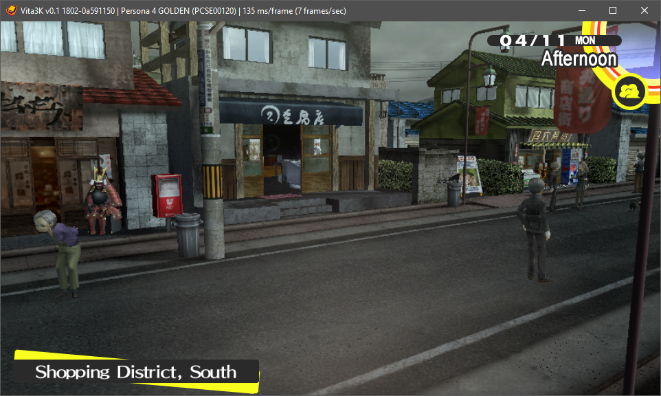

# Vita3K (Web Port - notawindstone Bugfix Fork)

## Introduction

Vita3K is an experimental PlayStation Vita emulator for Windows, Linux, macOS, Android, and the web. 

This fork includes critical bugfixes by **notawindstone** targeting the experimental WebAssembly/WebGPU browser port (`browser/`), resolving core execution and stability issues in browser environments.

* [Upstream Website](https://vita3k.org/) (official project info)
* [Wiki](https://github.com/Vita3K/Vita3K/wiki) (developer documentation)
* [Discord Server](https://discord.gg/MaWhJVH) (official community)

## Browser Port & notawindstone Fixes

Vita3K includes an in-tree WebAssembly/WebGPU port located under `browser/`. This branch integrates bugfixes and stability improvements by **notawindstone** to ensure the web runtime initializes and runs accurately.

* **Key Fixes:** Addresses critical browser port bugs, WebAssembly memory/threading quirks, and WebGPU pipeline synchronization issues.
* **Architecture:** See [ARCHITECTURE.md](./ARCHITECTURE.md) to understand how the browser components interface with core Vita3K modules.
* **Building & Testing:** Consult [SCRIPTS.md](./SCRIPTS.md) for web-specific build, serve, and testing steps.

## Compatibility

The emulator currently runs many homebrew titles and commercial games. Web port compatibility may vary compared to native desktop builds depending on browser WebGPU support.

- [Homebrew compatibility page](https://vita3k.org/compatibility-homebrew.html)
- [Commercial compatibility page](https://vita3k.org/compatibility.html)

## Gallery

|                **Persona 4 Golden** by Atlus                |                      **A Rose in the Twilight** by Nippon Ichi Software                         |
| :-----------------------------------------------------------: | :--------------------------------------------------------------------------------------------: |
|  |  |

|                   **Alone with You** by Benjamin Rivers                     |                  **VA-11 HALL-A** by Sukeban Games                     |
| :------------------------------------------------------------------------: | :------------------------------------------------------------------: |
|  |  |

|               **Fruit Ninja** by Halfbrick Studios                  |                **Jetpack Joyride** by Halfbrick Studios                     |
| :----------------------------------------------------------------: | :------------------------------------------------------------------------: |
|  |  |

## License

Vita3K is licensed under the **GPLv2** license. This is largely dictated by external dependencies, most notably Unicorn.

## Downloads & Web Deployment

- **Web Port:** Build instructions and artifacts for running the WebAssembly target locally or hosting it can be found in [`SCRIPTS.md`](./SCRIPTS.md).
- **Native Releases:** Upstream native builds are available [here](https://github.com/Vita3K/Vita3K/releases/tag/continuous).

* **Windows:** Requires [Microsoft Visual C++ 2015-2022 Redistributable](https://aka.ms/vs/17/release/vc_redist.x64.exe)
* **Linux (Arch-based):** `vita3k-bin` or `vita3k-git` (requires `xdg-desktop-portal`, OpenGL/Vulkan runtimes)
* **Android:** Requires compatible [Adreno drivers](https://github.com/K11MCH1/AdrenoToolsDrivers/releases/) where applicable
* **Artifacts & Archives:** [CI Artifacts](https://github.com/Vita3K/Vita3K/actions?query=event%3Apush+is%3Asuccess+branch%3Amaster) | [Archived Builds](https://github.com/Vita3K/Vita3K-builds/releases)

## Building

- For native builds, refer to [`building.md`](./building.md).
- For browser/WebAssembly builds incorporating this fix, refer to [`SCRIPTS.md`](./SCRIPTS.md) and [`ARCHITECTURE.md`](./ARCHITECTURE.md).

## Running

Check the [quickstart guide](https://vita3k.org/quickstart) to ensure hardware minimum requirements are met. When running the web port, make sure your browser has **WebGPU** and **WebAssembly SIMD/Threads** enabled.

## Bugs and Issues

The browser port and emulator core are experimental. If you encounter bugs specific to this fork or the `notawindstone` web changes, please file an issue with runtime console logs and browser specifications included.

## Thanks

Thanks go out to **notawindstone** for browser port bugfixes, along with original contributors and advisors who made Vita3K possible: Davee, korruptor, Rinnegatamante, ScHlAuChi, Simon Kilroy, TheFlow, xerpi, xyz, Yifan Lu, and many others.

## Donations

 
Support the upstream project on [ko-fi](https://ko-fi.com/vita3K).  
* Nibble Tier and above supporters: **j0hnnybrav0, Mored4u, TacoOblivion, Undeadbob, and uplush**.

## Note

The purpose of this emulator is not to enable illegal activity. You can dump games from a Vita using [NoNpDrm](https://github.com/TheOfficialFloW/NoNpDrm) or [FAGDec](https://github.com/CelesteBlue-dev/PSVita-RE-tools/tree/master/FAGDec/build). Homebrew titles can be obtained via [VitaDB](https://www.rinnegatamante.eu/vitadb/#/).

PlayStation, PlayStation Vita, and PlayStation Network are registered trademarks of Sony Interactive Entertainment Inc. This project is not affiliated with, endorsed by, or derived from confidential materials belonging to Sony.
